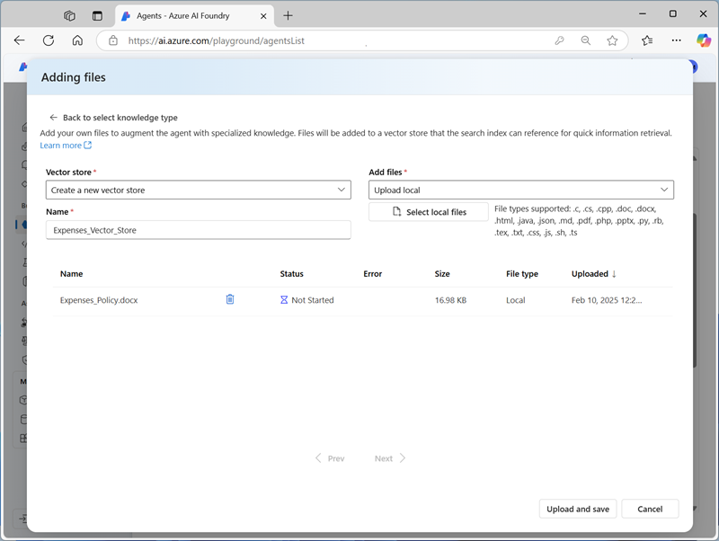

---
lab:
  title: Découvrir le développement d’agents IA
  description: Découvrez les étapes de développement d’agents IA en explorant les outils Azure AI Agent Service dans le portail Azure AI Foundry.
---

# Découvrir le développement d’agents IA

Dans cet exercice, vous utilisez les outils Azure AI Agent Service dans le portail Azure AI Foundry pour créer un agent IA simple qui répond aux questions relatives aux notes de frais.

Cet exercice prend environ **30** minutes.

> **Note** : certaines des technologies utilisées dans cet exercice sont en version préliminaire ou en cours de développement. Un comportement inattendu, des avertissements ou des erreurs peuvent se produire.

## Créer un projet Azure AI Foundry

Commençons par créer un projet Azure AI Foundry.

1. Dans un navigateur web, ouvrez le [portail Azure AI Foundry](https://ai.azure.com) à l’adresse `https://ai.azure.com` et connectez-vous en utilisant vos informations d’identification Azure. Fermez les conseils ou les volets de démarrage rapide ouverts la première fois que vous vous connectez et, si nécessaire, utilisez le logo **Azure AI Foundry** en haut à gauche pour accéder à la page d’accueil, qui ressemble à l’image suivante (fermez le volet **Aide** s’il est ouvert) :

    

1. Sur la page d’accueil, sélectionnez **+Créer un projet**.
1. Dans l’assistant **Créer un projet**, saisissez un nom valide et, si un hub existant est suggéré, choisissez l’option permettant d’en créer un. Passez ensuite en revue les ressources Azure qui seront créées automatiquement pour prendre en charge votre hub et votre projet.
1. Sélectionnez **Personnaliser** et spécifiez les paramètres suivants pour votre hub :
    - **Nom du hub** : *un nom valide pour votre hub*
    - **Abonnement** : *votre abonnement Azure*
    - **Groupe de ressources** : *créez ou sélectionnez un groupe de ressources*
    - **Emplacement** : sélectionnez l’une des régions suivantes :\*
        - eastus
        - eastus2
        - centre de la suède
        - westus
        - westus3
    - **Connecter Azure AI Services ou Azure OpenAI** : *créer une nouvelle ressource AI Services*
    - **Connecter la Recherche Azure AI** : ignorer la connexion

    > \* Au moment de l’écriture, ces régions prennent en charge le modèle gpt-4o à utiliser pour les agents. La disponibilité des modèles est limitée par les quotas régionaux. Si une limite de quota est atteinte plus tard dans l’exercice, vous devrez peut-être créer un autre projet dans une autre région.

1. Sélectionnez **Suivant** et passez en revue votre configuration. Sélectionnez **Créer** et patientez jusqu’à ce que l’opération se termine.
1. Une fois votre projet créé, fermez les conseils affichés et passez en revue la page du projet dans le portail Azure AI Foundry, qui doit ressembler à l’image suivante :

    

## Déployer un modèle d’IA générative

Vous avez effectué toutes les préparations nécessaires au déploiement d’un modèle de langage d’IA générative pour votre agent.

1. Dans le volet de gauche de votre projet, dans la section **Mes ressources**, sélectionnez la page **Modèles + points de terminaison**.
1. Sur la page **Modèles + points de terminaison**, dans l’onglet **Déploiements de modèles**, dans le menu **+ Déployer un modèle**, sélectionnez **Déployer le modèle de base**.
1. Recherchez le modèle **gpt-4o** dans la liste, puis sélectionnez-le et confirmez.
1. Déployez le modèle avec les paramètres suivants en sélectionnant **Personnaliser** dans les détails du déploiement :
    - **Nom du déploiement** : *nom valide pour votre modèle de déploiement*
    - **Type de déploiement** : standard global
    - **Mise à jour automatique de la version** : activée
    - **Version du modèle** : *sélectionnez la version la plus récente disponible.*
    - **Ressource IA connectée** : *sélectionnez votre connexion de ressources Azure OpenAI*
    - **Limite de jetons par minute (en milliers)**  : 50 *(ou le maximum disponible dans votre abonnement si inférieur à 50 000)*
    - **Filtre de contenu** : DefaultV2

    > **Remarque** : La réduction du nombre de jetons par minute permet d’éviter une surutilisation du quota disponible dans l’abonnement que vous utilisez. 50 000 jetons par minute sont suffisants pour les données utilisées dans cet exercice. Si votre quota disponible est inférieur à ce montant, vous serez en mesure d’effectuer l’exercice, mais vous devrez peut-être patienter et soumettre à nouveau les invites si la limite de jetons est dépassée.

1. Attendez la fin du déploiement.

## Créer un agent IA

Maintenant que vous avez déployé un modèle, tout est prêt pour créer un agent IA. Dans cet exercice, vous allez créer un agent simple qui répond aux questions en fonction de la stratégie de dépenses d’une entreprise. Vous allez télécharger le document de stratégie de dépenses et l’utiliser comme données *de base* pour l’agent.

1. Ouvrez un nouvel onglet de navigateur, téléchargez le fichier [Expenses_policy.docx](https://raw.githubusercontent.com/MicrosoftLearning/mslearn-ai-agents/main/Labfiles/01-agent-fundamentals/Expenses_Policy.docx) à partir de `https://raw.githubusercontent.com/MicrosoftLearning/mslearn-ai-agents/main/Labfiles/01-agent-fundamentals/Expenses_Policy.docx`, et enregistrez-le sur votre ordinateur. Ce document contient les détails de la politique des dépenses pour la société Contoso fictive.
1. Revenez à l’onglet du navigateur contenant le portail Azure AI Foundry et, dans le volet de navigation de gauche, dans la section **Générer et personnaliser**, sélectionnez la page **Agents**.
1. Si l’invite apparaît, sélectionnez la ressource Azure OpenAI Service et continuez.

    Un nouvel agent portant un nom tel que *Agent123* devrait être créé automatiquement (si ce n’est pas le cas, utilisez le bouton **+Nouvel agent** pour en créer un).

1. Sélectionnez votre nouvel agent. Ensuite, dans le volet **Configuration** de votre nouvel agent, définissez le **nom de l’agent** sur `ExpensesAgent`, vérifiez que le modèle de déploiement gpt-4o que vous avez créé précédemment est sélectionné et définissez les **instructions** sur `Answer questions related to expense claims`.

    

1. Plus loin dans le volet **Configuration**, en regard de l’en-tête **Connaissances**, sélectionnez **+ Ajouter**. Ensuite, dans la boîte de dialogue **Ajouter une connaissance**, sélectionnez **Fichiers**.
1. Dans la boîte de dialogue **Ajout de fichiers**, créez un magasin de vecteurs nommé `Expenses_Vector_Store`, chargez et enregistrez le fichier local **Expenses_policy.docx** que vous avez téléchargé précédemment.

    

1. Dans le volet **Configuration**, dans la section **Connaissances**, vérifiez que le fichier **Expenses_Vector_Store** apparaît et qu’il contient 1 fichier.

    > **Remarque** : vous pouvez également ajouter des **actions** à un agent pour automatiser les tâches. Dans cet exemple d’agent de récupération d’informations simple, aucune action n’est requise.

## Tester l’agent

Maintenant que vous avez créé un agent, vous pouvez le tester dans le terrain de jeu du portail Azure AI Foundry.

1. En haut du volet **Configuration** de votre agent, sélectionnez **Tester dans le terrain de jeu**.
1. Dans le terrain de jeu, entrez l’invite `What's the maximum I can claim for meals?` et examinez la réponse de l’agent. Elle doit être basée sur les informations contenues dans le document de stratégie de dépenses que vous avez ajouté en tant que connaissance à la configuration de l’agent.

    

    > **Remarque** : si l’agent ne répond pas, cela signifie que le taux limite a été dépassé. patientez quelques secondes, puis réessayez. Si le quota disponible dans votre abonnement est insuffisant, le modèle peut ne pas être en mesure de répondre.

1. Posez une question complémentaire, telle que `What about accommodation?`, et lisez la réponse.

## Nettoyage

Maintenant que vous avez terminé l’exercice, vous devez supprimer les ressources cloud que vous avez créées pour éviter une utilisation inutile des ressources.

1. Ouvrez le [portail Azure](https://portal.azure.com) à l’adresse `https://portal.azure.com` et affichez le contenu du groupe de ressources où vous avez déployé les ressources de hub utilisées dans cet exercice.
1. Dans la barre d’outils, sélectionnez **Supprimer le groupe de ressources**.
1. Entrez le nom du groupe de ressources et confirmez que vous souhaitez le supprimer.
