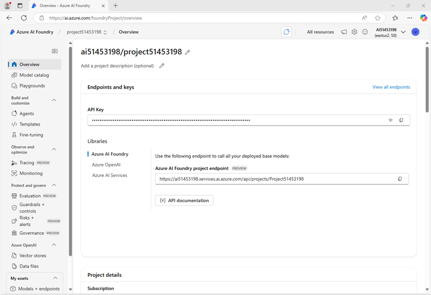

---
lab:
  title: Connectez-vous à des agents distants à l'aide du protocole A2A
  description: Utilisez le protocole A2A pour collaborer avec des agents distants.
---

# Connectez-vous à des agents distants à l'aide du protocole A2A

Dans cet exercice, vous utiliserez Azure AI Agent Service avec le protocole A2A pour créer des agents distants simples qui interagissent entre eux. Ces agents aideront les rédacteurs techniques à préparer leurs articles de blog destinés aux développeurs. Un agent de titre générera un titre, et un agent de plan utilisera ce titre pour élaborer un plan concis pour l'article. Prise en main

> **Conseil** : Le code utilisé dans cet exercice est basé sur le kit de développement logiciel (SDK) Microsoft Foundry pour Python. Vous pouvez développer des solutions similaires à l’aide des kits de développement logiciel (SDK) pour Microsoft .NET, JavaScript et Java. Pour plus d’informations, consultez les [bibliothèques client du kit de développement logiciel (SDK) Microsoft Foundry](https://learn.microsoft.com/azure/ai-foundry/how-to/develop/sdk-overview).

Cet exercice devrait prendre environ **30** minutes.

> **Note** : certaines des technologies utilisées dans cet exercice sont en version préliminaire ou en cours de développement. Un comportement inattendu, des avertissements ou des erreurs peuvent se produire.

## Créer un projet Foundry

Commençons par créer un projet Foundry.

1. Dans un navigateur web, ouvrez le [portail Foundry](https://ai.azure.com) à l’adresse `https://ai.azure.com` et connectez-vous en utilisant vos informations d’identification Azure. Fermez les conseils ou les volets de démarrage rapide ouverts la première fois que vous vous connectez et, si nécessaire, utilisez le logo **Foundry** en haut à gauche pour accéder à la page d’accueil, qui ressemble à l’image suivante (fermez le volet **Aide** s’il est ouvert) :

    

    > **Important** : Assurez-vous que le bouton bascule **Nouveau Foundry** est *désactivé* pour ce labo.

1. Sur la page d’accueil, sélectionnez **Créer un agent**.
1. Lorsque vous êtes invité à créer un projet, entrez un nom valide pour votre projet et développez les **options avancées**.
1. Confirmez les paramètres suivants pour votre projet :
    - **Ressource Foundry** : *Nom valide de votre ressource Foundry*
    - **Abonnement** : *votre abonnement Azure*
    - **Groupe de ressources** : *créez ou sélectionnez un groupe de ressources*
    - **Région** : *Sélectionnez n’importe quelle **recommandation d’AI Foundry***\*

    > \* Certaines ressources Azure AI sont limitées par des quotas de modèles régionaux. Si une limite de quota est atteinte plus tard dans l’exercice, vous devrez peut-être créer une autre ressource dans une autre région.

1. Sélectionnez **Créer** et attendez que votre projet soit créé.
1. Si vous y êtes invité, déployez un modèle **gpt-4o** en utilisant l’option de déploiement *Standard global* ou *Standard* (selon la disponibilité de votre quota).

    >**Remarque** : Si un quota est disponible, un modèle de base GPT-4o peut être déployé automatiquement lors de la création de votre Agent et de votre projet.

1. Une fois votre projet créé, le terrain de jeu Agents est ouvert.

1. Dans le volet de navigation à gauche, sélectionnez **Vue d’ensemble** pour accéder à la page principale de votre projet ; elle se présente comme suit :

    

1. Copiez les valeurs **Point de terminaison du projet Foundry** dans un bloc-notes, car vous les utiliserez pour vous connecter à votre projet dans une application cliente.

## Créer une application A2A

Vous êtes maintenant prêt à créer une application cliente qui utilise un agent. Tout le code dont vous avez besoin est fourni dans un référentiel GitHub.

### Cloner le référentiel contenant le code de l’application

1. Ouvrez un nouvel onglet de navigateur (en gardant le portail Foundry ouvert dans l’onglet existant). Dans un nouvel onglet du navigateur, ouvrez le [portail Azure](https://portal.azure.com) à l’adresse `https://portal.azure.com` et connectez-vous en utilisant vos informations d’identification Azure.

    Fermez les notifications de bienvenue pour afficher la page d’accueil du portail Azure.

1. Utilisez le bouton **[\>_]** à droite de la barre de recherche, en haut de la page, pour créer un environnement Cloud Shell dans le portail Azure, puis sélectionnez un environnement ***PowerShell*** avec aucun stockage dans votre abonnement.

    Cloud Shell fournit une interface de ligne de commande via un volet situé en bas du portail Azure. Vous pouvez redimensionner ou agrandir ce volet pour faciliter le travail.

    > **Remarque** : si vous avez déjà créé un Cloud Shell qui utilise un environnement *Bash*, basculez-le vers ***PowerShell***.

1. Dans la barre d’outils Cloud Shell, dans le menu **Paramètres**, sélectionnez **Accéder à la version classique** (cela est nécessaire pour utiliser l’éditeur de code).

    **<font color="red">Assurez-vous d’avoir basculé vers la version classique du Cloud Shell avant de continuer.</font>**

1. Dans le volet Cloud Shell, saisissez les commandes suivantes pour cloner le référentiel GitHub contenant les fichiers de code pour cet exercice (saisissez la commande, ou copiez-la dans le presse-papiers puis effectuez un clic droit dans la ligne de commande pour la coller en texte brut) :

    ```
   rm -r ai-agents -f
   git clone https://github.com/MicrosoftLearning/mslearn-ai-agents ai-agents
    ```

    > **Conseil** : lorsque vous saisissez des commandes dans le Cloud Shell, la sortie peut occuper une grande partie de la mémoire tampon d’écran et le curseur de la ligne actuelle peut être masqué. Vous pouvez effacer le contenu de l’écran en saisissant la commande `cls` pour faciliter le focus sur chaque tâche.

1. Entrez la commande suivante pour modifier le répertoire de travail vers le dossier contenant les fichiers de code, puis les répertorier tous.

    ```
   cd ai-agents/Labfiles/06-build-remote-agents-with-a2a/python
   ls -a -l
    ```

    Les fichiers fournis comprennent :
    ```output
    python
    ├── outline_agent/
    │   ├── agent.py
    │   ├── agent_executor.py
    │   └── server.py
    ├── routing_agent/
    │   ├── agent.py
    │   └── server.py
    ├── title_agent/
    │   ├── agent.py
    |   ├── agent_executor.py
    │   └── server.py
    ├── client.py
    └── run_all.py
    ```

    Chaque dossier d'agent contient le code de l'agent Azure AI et un serveur pour héberger l'agent. L'**agent de routage** est chargé de détecter et de communiquer avec les agents de **titre** et de **plan**. Le **client** permet aux utilisateurs d’envoyer des invites à l’agent de routage. `run_all.py` lance tous les serveurs et exécute le client.

### Configurer les paramètres de l’application

1. Dans le volet de ligne de commande Cloud Shell, saisissez la commande suivante pour installer les bibliothèques que vous allez utiliser :

    ```
   python -m venv labenv
   ./labenv/bin/Activate.ps1
   pip install -r requirements.txt azure-ai-projects azure-ai-agents a2a-sdk
    ```

1. Saisissez la commande suivante pour modifier le fichier de configuration fourni :

    ```
   code .env
    ```

    Le fichier s’ouvre dans un éditeur de code.

1. Dans le fichier de code, remplacez l’espace réservé **your_project_endpoint** par le point de terminaison de votre projet (copié à partir de la page **Vue d’ensemble** du projet dans le portail Foundry) et vérifiez que la variable MODEL_DEPLOYMENT_NAME est définie sur votre nom de modèle de déploiement (qui doit être *gpt-4o*).
1. Une fois que vous avez remplacé l’espace réservé, utilisez la commande **Ctrl+S** pour enregistrer vos modifications, puis utilisez la commande **Ctrl+Q** pour fermer l’éditeur de code tout en gardant la ligne de commande Cloud Shell ouverte.

### Créer un agent détectable

Dans cette tâche, vous allez créer l'agent de titres qui aide les rédacteurs à créer des titres tendance pour leurs articles. Vous définissez également les compétences de l'agent et la carte requise par le protocole A2A pour rendre l'agent détectable.

1. Accédez au répertoire `title_agent` :

    ```
   cd title_agent
    ```

> **Conseil** : lorsque vous ajoutez du code, veillez à conserver la mise en retrait correcte. Utilisez les niveaux de mise en retrait des commentaires comme guide.

1. Saisissez la commande suivante pour modifier le fichier de code fourni :

    ```
   code agent.py
    ```

1. Recherchez le commentaire **Créer le client de l’agent**, puis ajoutez le code suivant pour vous connecter au projet Azure AI :

    > **Conseil** : veillez à respecter le niveau de mise en retrait correct.

    ```python
   # Create the agents client
   self.client = AgentsClient(
       endpoint=os.environ['PROJECT_ENDPOINT'],
       credential=DefaultAzureCredential(
           exclude_environment_credential=True,
           exclude_managed_identity_credential=True
       )
   )
    ```

1. Recherchez le commentaire **Créer l'agent de titre** et ajoutez le code suivant pour créer l'agent :

    ```python
   # Create the title agent
   self.agent = self.client.create_agent(
       model=os.environ['MODEL_DEPLOYMENT_NAME'],
       name='title-agent',
       instructions="""
       You are a helpful writing assistant.
       Given a topic the user wants to write about, suggest a single clear and catchy blog post title.
       """,
   )
    ```

1. Recherchez le commentaire **Créer un fil de discussion pour la session de chat** et ajoutez le code suivant pour créer le fil de discussion :

    ```python
   # Create a thread for the chat session
   thread = self.client.threads.create()
    ```

1. Localisez le commentaire **Envoyer un message à l'utilisateur** et ajoutez ce code pour envoyer l'invite de l'utilisateur :

    ```python
   # Send user message
   self.client.messages.create(thread_id=thread.id, role=MessageRole.USER, content=user_message)
    ```

1. Sous le commentaire **Créer et exécuter l’agent**, ajoutez le code suivant pour lancer la génération de réponse de l’agent :

    ```python
   # Create and run the agent
   run = self.client.runs.create_and_process(thread_id=thread.id, agent_id=self.agent.id)
    ```

    Le code fourni dans le reste du fichier traitera et renverra la réponse de l'agent. 

1. Enregistrez le fichier (*Ctrl+S*). Vous êtes désormais prêt à partager les compétences et la carte de l'agent avec le protocole A2A. 

1. Entrez la commande suivante pour modifier le fichier de l'agent de titre `server.py`  

    ```
   code server.py
    ```

1. Recherchez le commentaire **Définir les compétences de l'agent** et ajoutez le code suivant pour spécifier les fonctionnalités de l'agent :

    ```python
   # Define agent skills
   skills = [
       AgentSkill(
           id='generate_blog_title',
           name='Generate Blog Title',
           description='Generates a blog title based on a topic',
           tags=['title'],
           examples=[
               'Can you give me a title for this article?',
           ],
       ),
   ]
    ```

1. Recherchez le commentaire **Créer une carte d’agent** et ajoutez ce code pour définir les métadonnées qui rendent l’agent détectable :

    ```python
   # Create agent card
   agent_card = AgentCard(
       name='AI Foundry Title Agent',
       description='An intelligent title generator agent powered by Foundry. '
       'I can help you generate catchy titles for your articles.',
       url=f'http://{host}:{port}/',
       version='1.0.0',
       default_input_modes=['text'],
       default_output_modes=['text'],
       capabilities=AgentCapabilities(),
       skills=skills,
   )
    ```

1. Recherchez le commentaire **Créer un exécuteur d’agent** et ajoutez le code suivant pour initialiser l’exécuteur de l’agent à l’aide de la carte de l’agent :

    ```python
   # Create agent executor
   agent_executor = create_foundry_agent_executor(agent_card)
    ```

    L'agent exécutif agira comme un wrapper pour l'agent de titre que vous avez créé.

1. Recherchez le commentaire **Créer un gestionnaire de requêtes** et ajoutez ce qui suit pour traiter les requêtes entrantes à l'aide de l'exécuteur :

    ```python
   # Create request handler
   request_handler = DefaultRequestHandler(
       agent_executor=agent_executor, task_store=InMemoryTaskStore()
   )
    ```

1. Sous le commentaire **Créer une application A2A**, ajoutez ce code pour créer l’instance d’application compatible A2A :

    ```python
   # Create A2A application
   a2a_app = A2AStarletteApplication(
       agent_card=agent_card, http_handler=request_handler
   )
    ```
    
    Ce code crée un serveur A2A qui partagera les informations de l'agent de titre et traitera les demandes entrantes pour cet agent à l'aide de l'exécuteur d'agent de titre.

1. Enregistrez le fichier de code (*Ctrl+S*) lorsque vous avez terminé.

### Activer les messages entre les agents

Dans cette tâche, vous utilisez le protocole A2A pour permettre à l’agent de routage d’envoyer des messages aux autres agents. Vous autorisez également l'agent de titre à recevoir des messages en implémentant la classe d'exécuteur d'agent.

1. Accédez au répertoire `routing_agent` :

    ```
   cd ../routing_agent
    ```

1. Saisissez la commande suivante pour modifier le fichier de code fourni :

    ```
   code agent.py
    ```

    L'agent de routage agit comme un orchestrateur qui traite les messages des utilisateurs et détermine quel agent distant doit traiter la demande.

    Lorsqu'un message utilisateur est reçu, l'agent de routage :
    - Lance un fil de discussion.
    - Utilise la méthode `create_and_process` pour évaluer l'agent le mieux adapté au message de l'utilisateur.
    - Le message est acheminé vers l’agent approprié via HTTP à l’aide de la `send_message` fonction.
    - L’agent distant traite le message et retourne une réponse.

    L’agent de routage capture enfin la réponse et la retourne à l’utilisateur via le thread.

    Notez que la méthode `send_message` est asynchrone et doit être attendue pour que l’exécution de l’agent se termine correctement.

1. Ajoutez le code suivant sous le commentaire **Récupérer le client A2A de l’agent distant à l’aide du nom** de l’agent :

    ```python
   # Retrieve the remote agent's A2A client using the agent name 
   client = self.remote_agent_connections[agent_name]
    ```

1. Recherchez le commentaire **Construire la charge utile à envoyer à l’agent** distant et ajoutez le code suivant :

    ```python
   # Construct the payload to send to the remote agent
   payload: dict[str, Any] = {
       'message': {
           'role': 'user',
           'parts': [{'kind': 'text', 'text': task}],
           'messageId': message_id,
       },
   }
    ```

1. Recherchez le commentaire **Encapsuler la charge utile dans un objet** SendMessageRequest et ajoutez le code suivant :

    ```python
   # Wrap the payload in a SendMessageRequest object
   message_request = SendMessageRequest(id=message_id, params=MessageSendParams.model_validate(payload))
    ```

1. Ajoutez le code suivant sous le commentaire **Envoyer le message au client de l’agent distant et attendez la réponse** :

    ```python
   # Send the message to the remote agent client and await the response
   send_response: SendMessageResponse = await client.send_message(message_request=message_request)
    ```


1. Enregistrez le fichier de code (*Ctrl+S*) lorsque vous avez terminé. Désormais, l'agent de routage est en mesure de détecter l'agent de titre et de lui envoyer des messages. Créons le code d'exécution de l'agent pour traiter les messages entrants provenant de l'agent de routage.

1. Accédez au répertoire `title_agent` :

    ```
   cd ../title_agent
    ```

1. Saisissez la commande suivante pour modifier le fichier de code fourni :

    ```
   code agent_executor.py
    ```

    L’implémentation `AgentExecutor` de classe doit contenir les méthodes `execute` et `cancel`. La méthode cancel a été fournie pour vous. La `execute` méthode inclut un `TaskUpdater` objet qui gère les événements et signale à l’appelant une fois la tâche terminée. Ajoutons la logique pour l’exécution des tâches.

1. Dans la `execute` méthode, ajoutez le code suivant sous le commentaire **Traiter la demande** :

    ```python
   # Process the request
   await self._process_request(context.message.parts, context.context_id, updater)
    ```

1. Dans la `_process_request` méthode, ajoutez le code suivant sous le commentaire **Obtenir l’agent** de titre :

    ```python
   # Get the title agent
   agent = await self._get_or_create_agent()
    ```

1. Ajoutez le code suivant sous le commentaire **Mettre à jour le statut de la tâche** :

    ```python
   # Update the task status
   await task_updater.update_status(
       TaskState.working,
       message=new_agent_text_message('Title Agent is processing your request...', context_id=context_id),
   )
    ```

1. Recherchez le commentaire **Exécuter la conversation de l'agent** et ajoutez le code suivant :

    ```python
   # Run the agent conversation
   responses = await agent.run_conversation(user_message)
    ```

1. Recherchez le commentaire **Mettre à jour la tâche avec les réponses** et ajoutez le code suivant :

    ```python
   # Update the task with the responses
   for response in responses:
       await task_updater.update_status(
           TaskState.working,
           message=new_agent_text_message(response, context_id=context_id),
       )
    ```

1. Recherchez le commentaire **Marquer la tâche comme terminée** et ajoutez le code suivant :

    ```python
   # Mark the task as complete
   final_message = responses[-1] if responses else 'Task completed.'
   await task_updater.complete(
       message=new_agent_text_message(final_message, context_id=context_id)
   )
    ```

    Votre agent de titre est désormais associé à un agent exécutif que le protocole A2A utilisera pour traiter les messages. Beau travail !

### Se connecter à Azure et exécuter l’application

1. Dans le volet de la ligne de commande Cloud Shell, entrez la commande suivante pour vous connecter à Azure.

    ```
    az login
    ```

    **<font color="red">Vous devez vous connecter à Azure, même si la session Cloud Shell est déjà authentifiée.</font>**

    > **Remarque** :dans la plupart des scénarios, l’utilisation d’*az login* suffit. Toutefois, si vous avez des abonnements dans plusieurs locataires, vous devrez peut-être spécifier le locataire à l’aide du paramètre *--tenant*. Pour plus d’informations, consultez [Se connecter à Azure de manière interactive à l’aide d’Azure CLI](https://learn.microsoft.com/cli/azure/authenticate-azure-cli-interactively).
    
1. Lorsque l’invite apparaît, suivez les instructions pour ouvrir la page de connexion dans un nouvel onglet et entrez le code d’authentification fourni ainsi que vos informations d’identification Azure. Effectuez ensuite le processus de connexion dans la ligne de commande, en sélectionnant l’abonnement contenant votre hub Foundry si nécessaire.
1. Une fois la connexion effectuée, entrez la commande suivante pour exécuter l’application :

    ```
    cd ..
    python run_all.py
    ```
    
    L’application s’exécute à l’aide des informations d’identification de votre session Azure authentifiée pour vous connecter à votre projet et créer et exécuter l’agent. Vous devriez voir apparaître des informations provenant de chaque serveur au fur et à mesure de leur démarrage.

1. Attendez que l’invite d’entrée s’affiche, puis entrez une invite telle que :

    ```
   Create a title and outline for an article about React programming.
    ```

    Après quelques instants, vous devriez voir une réponse de l’agent avec les résultats.

1. Entrez `quit` pour quitter le programme et arrêter les serveurs.
    
## Résumé

Dans cet exercice, vous avez utilisé le SDK Azure AI Agent Service et le SDK Python A2A pour créer une solution multi-agents à distance. Vous avez créé un agent compatible A2A détectable et configuré un agent de routage pour accéder aux compétences de l'agent. Vous avez également mis en place un agent exécutif pour traiter les messages A2A entrants et gérer les tâches. Beau travail !

## Nettoyage

Si vous avez terminé d’explorer Azure AI Agent Service, vous devez supprimer les ressources que vous avez créées dans cet exercice pour éviter de générer des coûts Azure inutiles.

1. Revenez à l’onglet du navigateur contenant le portail Azure (ou ouvrez à nouveau le [portail Azure](https://portal.azure.com) à l’adresse `https://portal.azure.com` dans un nouvel onglet de navigateur) et affichez le contenu du groupe de ressources dans lequel vous avez déployé les ressources utilisées dans cet exercice.
1. Dans la barre d’outils, sélectionnez **Supprimer le groupe de ressources**.
1. Entrez le nom du groupe de ressources et confirmez que vous souhaitez le supprimer.
