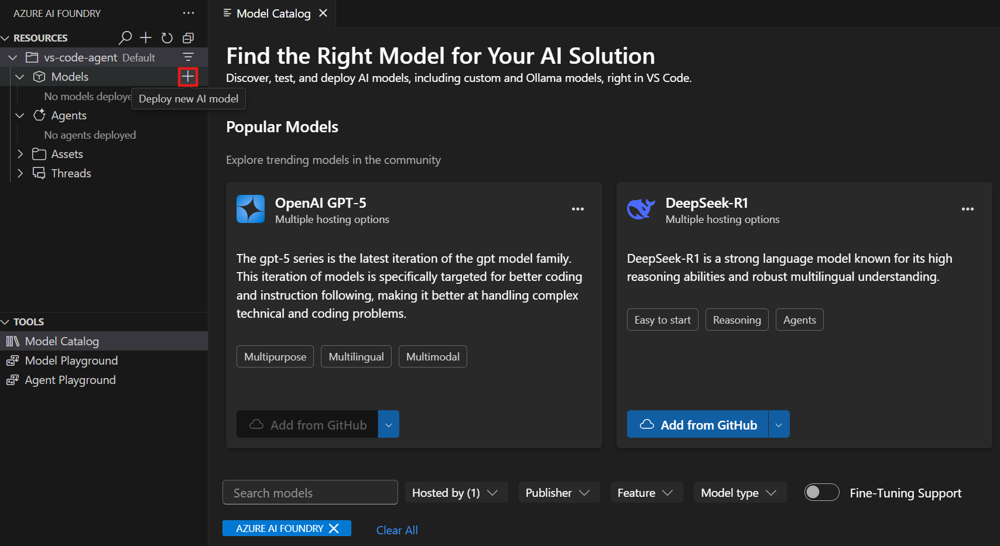

---
lab:
  title: Développer un assistant IA avec l’extension VS Code
  description: Utilisez l’extension Microsoft Foundry pour VS Code afin de créer un assistant IA.
---

# Développer un assistant IA avec l’extension VS Code

Dans cet exercice, vous allez utiliser l’extension Microsoft Foundry VS Code afin de créer un assistant capable d’utiliser les outils de serveur MCP (Model Context Protocol) pour accéder à des sources de données externes et à des API. L’assistant sera capable de récupérer des informations à jour et d’interagir avec divers services via les outils MCP.

Cet exercice devrait prendre environ **30** minutes.

> **Note** : certaines des technologies utilisées dans cet exercice sont en version préliminaire ou en cours de développement. Un comportement inattendu, des avertissements ou des erreurs peuvent se produire.

## Prérequis

Avant de commencer cet exercice, assurez-vous que vous disposez des éléments suivants :
- Visual Studio Code installé
- Un abonnement Azure actif

## Installez l’extension Microsoft Foundry pour VS Code

Commençons par installer et configurer l’extension VS Code.

1. Ouvrez Visual Studio Code.

1. Sélectionnez **Extensions** dans le volet gauche (ou appuyez sur **Ctrl+Maj+X**).

1. Dans la barre de recherche, tapez **Microsoft Foundry** et appuyez sur Entrée.

1. Sélectionnez l’extension **Microsoft Foundry** de Microsoft et cliquez sur **Installer**.

1. Une fois l’installation terminée, vérifiez que l’extension apparaît dans la barre de navigation principale à gauche de Visual Studio Code.

## Connectez-vous à Azure et créez un projet

Vous allez maintenant vous connecter à vos ressources Azure et créer un nouveau projet AI Foundry.

1. Dans la barre latérale de VS Code, sélectionnez l’icône de l’extension **Microsoft Foundry**.

1. Dans la vue Ressources, sélectionnez **Se connecter à Azure...** et suivez les prompts d’authentification.

   > **Remarque** : Vous ne verrez pas cette option si vous êtes déjà connecté.

1. Créez un nouveau projet Foundry en sélectionnant l’icône **+** (plus) à côté de **Ressources** dans la vue Extension Foundry.

1. Sélectionnez votre abonnement Azure dans la liste déroulante.

1. Choisissez de créer un nouveau groupe de ressources ou d’utiliser un groupe existant :
   
   **Pour créer un nouveau groupe de ressources :**
   - Sélectionnez **Créer un nouveau groupe de ressources**, puis appuyez sur Entrée
   - Entrez un nom pour votre groupe de ressources (par exemple, « rg-ai-agents-lab ») et appuyez sur Entrée
   - Sélectionnez un emplacement parmi les options disponibles et appuyez sur Entrée
   
   **Pour utiliser un groupe de ressources existant :**
   - Sélectionnez le groupe de ressources que vous souhaitez utiliser dans la liste et appuyez sur Entrée

1. Entrez un nom pour votre projet Foundry (par exemple, « ai-agents-project ») dans la zone de texte et appuyez sur Entrée.

1. Attendez la fin du déploiement du projet. Une fenêtre contextuelle apparaîtra avec le message « Projet déployé avec succès ».

## Déployer un modèle

Vous aurez besoin d’un modèle déployé à utiliser avec votre assistant.

1. Lorsque la fenêtre contextuelle « Projet déployé avec succès » s’affiche, sélectionnez le bouton **Déployer un modèle**. Cela ouvre le catalogue de modèles.

   > **Conseil** : Vous pouvez également accéder au Catalogue de modèles en sélectionnant l’icône **+** à côté de **Modèles** dans la section Ressources, ou en appuyant sur **F1** et en exécutant la commande **Microsoft Foundry : Ouvrez le catalogue de modèles**.

1. Dans le Catalogue de modèles, recherchez le modèle **gpt-4** (vous pouvez utiliser la barre de recherche pour le trouver rapidement).

    

1. Sélectionnez **Déployer** à côté du modèle gpt-4.

1. Configurez les paramètres de déploiement :
   - **Nom du déploiement** : Entrez un nom tel que « gpt-4-deployment »
   - **Type de déploiement** : Sélectionnez **Global Standard** (ou **Standard** si Global Standard n’est pas disponible)
   - **Version du modèle** : Laissez par défaut
   - **Jetons par minute** : Laissez par défaut

1. Sélectionnez **Déployer dans Microsoft Foundry** dans le coin inférieur gauche.

1. Dans la boîte de dialogue de confirmation, sélectionnez **Déployer** pour déployer le modèle.

1. Attendez la fin du déploiement. Votre modèle déployé apparaîtra dans la section **Modèles** de la vue Ressources.

## Créer un assistant IA avec la vue concepteur

Vous allez maintenant créer un assistant IA à l’aide de l’interface du concepteur visuel. Au lieu d’écrire du code, vous allez configurer les instructions, les paramètres et les outils de l’assistant via l’interface utilisateur.

1. Dans la vue de l’extension Microsoft Foundry, recherchez la section **Ressources**.

1. Sélectionnez l’icône **+** (signe plus) à côté de la sous-section **Assistants déclaratifs** pour créer un nouvel assistant IA.

    

1. Choisissez un emplacement pour enregistrer les fichiers de votre assistant lorsque vous y êtes invité.

1. Un onglet **Nouvel assistant** s’ouvrira dans l’éditeur « Préférences de l’assistant », avec un fichier de configuration `.yaml`.

### Configurez votre assistant dans le concepteur

1. Dans les préférences de l’assistant, configurez les champs suivants :
   - **Nom** : Entrez un nom descriptif pour votre assistant (par exemple, « data-research-agent »)
   - **Modèle** : Sélectionnez votre déploiement GPT-4o dans la liste déroulante
   - **Instructions** : Entrez les instructions système telles que :
     ```
     You are an AI agent that helps users research information from various sources. Use the available tools to access up-to-date information and provide comprehensive responses based on external data sources.
     ```

1. Enregistrez la configuration en sélectionnant **Fichier > Enregistrer** dans la barre de menus VS Code.

## Ajoutez un outil de Serveur MCP à votre assistant

Vous allez maintenant ajouter un outil de Serveur MCP (Model Context Protocol) qui permet à votre assistant d’accéder à des API et des sources de données externes.

1. Dans la section **OUTIL** du concepteur, sélectionnez le bouton **Ajouter un outil** dans le coin supérieur droit.


1. Dans le menu déroulant, choisissez **Serveur MCP**.

1. Configurez l’outil de Serveur MCP avec les informations suivantes :
   - **URL du serveur** : Entrez l’URL d’un serveur MCP (par exemple : `https://gitmcp.io/Azure/azure-rest-api-specs`)
   - **Étiquette du serveur** : Entrez un identificateur unique (par exemple, « github_docs_server »)

1. Laissez la liste déroulante **Outils autorisés** vide pour autoriser tous les outils du serveur MCP.

1. Sélectionnez le bouton **Créer un outil** pour ajouter l’outil à votre assistant.

## Déployez votre assistant sur Microsoft Foundry

1. Dans la vue du concepteur d’assistant, sélectionnez le bouton **Créer un assistant sur Microsoft Foundry** dans le coin inférieur gauche.

1. Attendez la fin du déploiement.

1. Dans la barre de navigation VS Code, actualisez la vue **Ressources**. Votre assistant déployé devrait maintenant apparaître dans la sous-section **Assistants déclaratifs**.

## Testez votre assistant dans le terrain de jeu

1. Faites un clic droit sur votre assistant déployé dans la sous-section **Assistants déclaratifs**.

1. Sélectionnez **Ouvrir le terrain de jeu** dans le menu contextuel.

1. Le terrain de jeu des assistants s’ouvrira dans un nouvel onglet dans VS Code.

1. Tapez un prompt de test tel que :

   ```output
   Can you help me find documentation about Azure Container Apps and provide an example of how to create one?
   ```

1. Envoyez le message et observez les prompts d’authentification et d’approbation pour l’outil de serveur MCP :
    - Pour cet exercice, sélectionnez **Aucune authentification** lorsque vous y êtes invité.
    - Pour la préférence d’approbation des outils MCP, vous pouvez sélectionner **Toujours approuver**.

1. Passez en revue la réponse de l’assistant et notez comment il utilise l’outil de serveur MCP pour récupérer des informations externes.

1. Consultez la section **Annotations de l’assistant** pour voir les sources d’informations utilisées par l’assistant.

## Générez un exemple de code pour votre assistant

1. Faites un clic droit sur votre assistant déployé et sélectionnez **Ouvrir le fichier de code**, ou sélectionnez le bouton **Ouvrir le fichier de code** dans la page Préférences de l’assistant.

1. Choisissez votre kit de développement logiciel (SDK) préféré dans le menu déroulant (Python, .NET, JavaScript ou Java).

1. Sélectionnez votre langage de programmation préféré.

1. Choisissez votre méthode d’authentification préférée.

1. Passez en revue l’exemple de code généré qui montre comment interagir avec votre assistant par programmation.

Vous pouvez utiliser ce code comme point de départ pour créer des applications qui exploitent votre assistant IA.

## Afficher l’historique des conversations et les fils de discussion

1. Dans la vue **Ressources Azure**, développez la sous-section **Fils de discussion** pour afficher les conversations créées pendant les interactions de votre assistant.

1. Sélectionnez un fil de discussion pour afficher la page **Détails du fil de discussion**, qui affiche :
   - Les messages individuels de la conversation
   - Les informations et détails d’exécution
   - Les réponses de l’assistant et l’utilisation des outils

1. Sélectionnez **Afficher les informations d’exécution** pour afficher les informations JSON détaillées sur chaque exécution.

## Résumé

Dans cet exercice, vous avez utilisé l’extension Foundry pour VS Code pour créer un assistant IA avec les outils de serveur MCP. L’assistant peut accéder à des sources de données externes et à des API via le serveur MCP (Model Context Protocol), ce qui lui permet de fournir des informations à jour et d’interagir avec divers services. Vous avez également appris à tester l’assistant dans le terrain de jeu et à générer un exemple de code pour l’interaction par programmation.

## Nettoyage

Une fois que vous avez terminé d’explorer l’extension Foundry pour VS Code, vous devez nettoyer les ressources afin d’éviter des coûts Azure inutiles.

### Supprimez vos assistants

1. Dans le portail Foundry, sélectionnez **Assistants** dans le menu de navigation.

1. Sélectionnez votre assistant, puis sélectionnez le bouton **Supprimer**.

### Supprimez vos modèles

1. Dans VS Code, actualisez la vue **Ressources Azure**.

1. Développez la sous-section **Modèles**.

1. Faites un clic droit sur votre modèle déployé et sélectionnez **Supprimer**.

### Supprimer les autres ressources

1. Ouvrez le [portail Azure](https://portal.azure.com).

1. Accédez au groupe de ressources contenant vos ressources AI Foundry.

1. Sélectionnez **Supprimer le groupe de ressources** et confirmez la suppression.